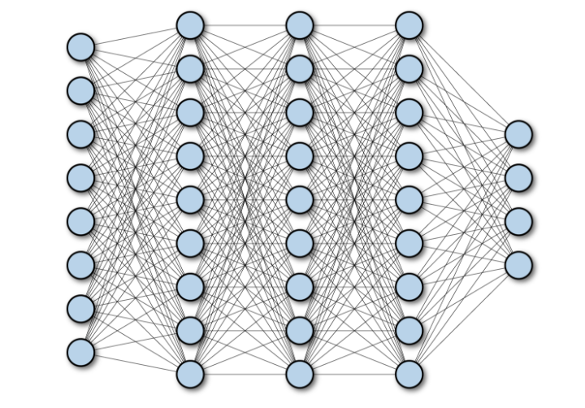
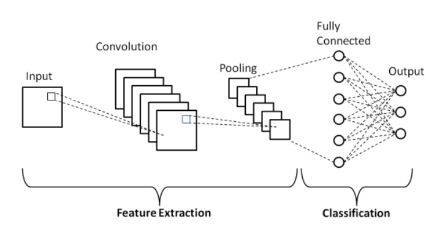

# Proyecto: MNIST

Problema: Categorización de números (y letras) escritas a mano.

---
# Descripción del Dataset MNIST

## ¿Qué es?

El dataset MNIST (Modified National Institute of Standards and Technology) o MNIST Database, en una base de datos que contiene una recopilación de números (dígitos) escritos a mano. Este conjunto fue creado a partir de un *re-muestreo* de un conjunto previo conocido como NIST.

Esta base de datos es comúnmente utilizada para el entrenamiento de varios sistemas de procesamiento de imágenes, como en nuestro caso se utilizará para una red neuronal.

## Características

Algunas características de este dataset son:

* Cuenta con 60,000 imágenes de entrenamiento y 10,000 imágenes de prueba. 
    * Cada imágen corresponde a un número en el rango [0,9]
    * Las imágenes tienen un tamaño de 28x28x1

* Este dataset se considera como "resuelto", ya que se ha logrado alcanzar tasas de error considerablemente pequeñas para este conjunto.
* Es un conjunto "limpio", ya que los datos en este conjunto están ya limpias y curadas especialmente para entrenamiento.
    * Si bien esto facilita el entrenamiento, no necesariamente representa una muestra representativa de la vida real.
    * Las imagenes se encuentran centradas y normalizadas.

## Repositorio de datos

Al ser un dataset tan conocido y estudiado, existen diversas fuentes que ofrecen acceso a éste, en nuestro caso, usaremos la version incluida en el librería de aprendizaje automático TensorFlow.

---
# Historia del MNIST

---
# Redes Neuronales para solucionar el problema

## El "Problema" de las Redes Neuronales

A pesar de que las redes neuronales han ganado una enorme popularidad en los últimos 10 años (especialmente tras el uso de las GPUs y TPUs para el entrenamiento de datos), para la mayoria de 
científicos de datos y estadísticos la mayoría de las familias de modelos tienen el problema de que son **difíciles de interpretar**. Es por esto que muchas personas tratan a las redes neuronales y su estructura como si fuese una *caja negra* porque es dificil pensar en cómo se modela y transmite la información.

Frecuentemente, las redes neuronales tienen cientos de miles de parámetros, con millones de pesos que son individualmente tuneados durante el entrenamiento par minimizar el error que puede existir.

## Arquitectura de las Redes Neuronales

Con el MNIST se pueden aplicar varios diseños al ser un conjunto de datos relativamente sencillo de estudiar. Incluso se han desarrollo modelos que no necesariamente tienen que ver con el uso de redes neuronales. Sin embargo, podemos usar los siguientes modelos:

### Fully-Connected Neural Networks (FCN)

### Convolutional Meural Networs (CNN)
