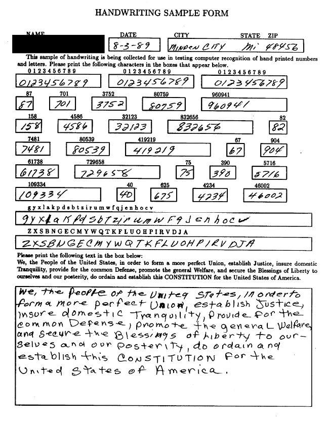

# Proyecto: MNIST

Problema: Categorización de números (y letras) escritas a mano.

---
# Descripción del Dataset MNIST

---
## Historia del MNIST

*National Institute of Standards and Technology* (**NIST**) es un instituto en los Estados Unidos, cuya misión es promover la innovación y la competencia industrial en el país. Como parte de esta misión, los científicos e ingenieros del NIST continuamente refinan la ciencia de la medición (metrología) y utilizan grandes bases de datos para su continua experimentación.

<figure>
    

    

    <figcaption align = "center">Documento utilizado para la recolección de los Datos en 1989</figcaption>
</figure>

El conjunto de imágenes en el MNIST database fue creado en 1994 como una combinación de dos bases de datos en NIST: *Special Database 1* and *Special Database 3*. Estas bases de datos consistían en dígitos escritos por estudiantes de preparatoria y empleados de la Oficina del Censo de los Estados Unidos, respectivamente.

---
# Redes Neuronales para solucionar el problema

## El "Problema" de las Redes Neuronales

A pesar de que las redes neuronales han ganado una enorme popularidad en los últimos 10 años (especialmente tras el uso de las GPUs y TPUs para el entrenamiento de datos), para la mayoria de 
científicos de datos y estadísticos la mayoría de las familias de modelos tienen el problema de que son **difíciles de interpretar**. Es por esto que muchas personas tratan a las redes neuronales y su estructura como si fuese una *caja negra* porque es dificil pensar en cómo se modela y transmite la información.

Frecuentemente, las redes neuronales tienen cientos de miles de parámetros, con millones de pesos que son individualmente tuneados durante el entrenamiento par minimizar el error que puede existir.

## Arquitectura de las Redes Neuronales

Con el MNIST se pueden aplicar varios diseños al ser un conjunto de datos relativamente sencillo de estudiar. Incluso se han desarrollo modelos que no necesariamente tienen que ver con el uso de redes neuronales. Sin embargo, podemos usar los siguientes modelos:

### Fully-Connected Neural Networks (FCN)

### Convolutional Meural Networs (CNN)
